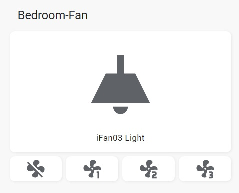

# sonoff_ifan03_esphome_ha
Sonoff iFan03 setup via ESPhome for Home Assistant

The setup files are as I use them in my Enviroment, you may need to change a few of the details to work for you.

Move the ifan03.h file into your ESPhome folder/directory <strong>(/config/esphome)</strong> of your Home Assistant installation or copy the contents of the file to a new file also call ifan03.h via any code editor.

Use lovelace-dashboard-buttons.yaml content to manually create a button card for your dashboard.

